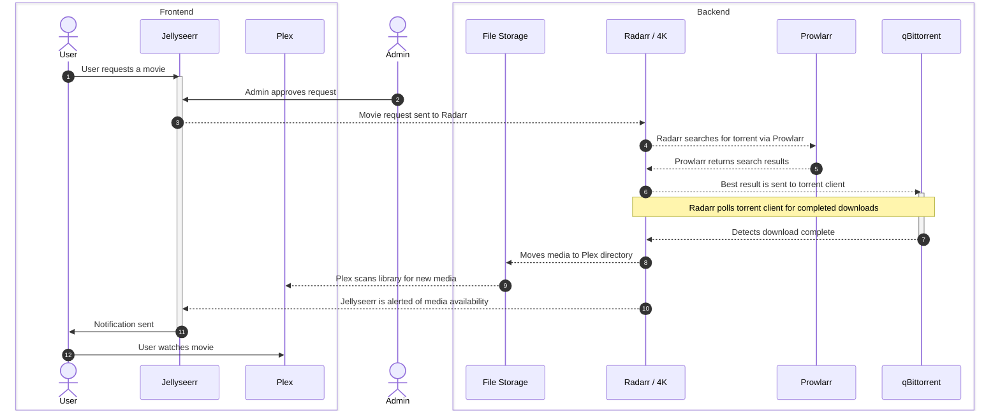
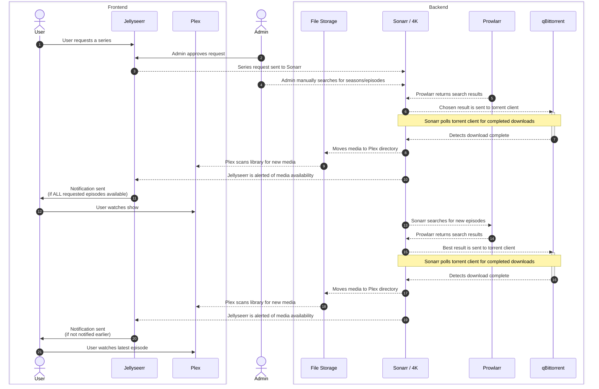
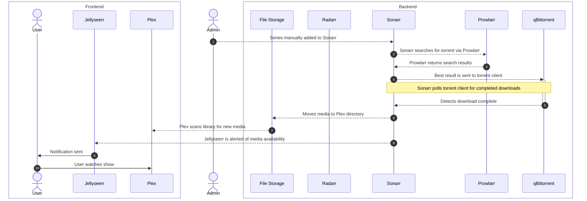

## System Diagrams

### Movie Processing Using Jellyseerr

```mermaid
sequenceDiagram
  autonumber
  box Frontend
  actor User
  participant Jellyseerr
  participant Plex
  end
  actor Admin
  box Backend
  participant File Storage
  participant Radarr / 4K
  participant Prowlarr
  participant qBittorrent
  end
  User->>Jellyseerr: User requests a movie
  activate Jellyseerr
  Admin->>Jellyseerr: Admin approves request
  Jellyseerr-->>Radarr / 4K: Movie request sent to Radarr
  Radarr / 4K-->>Prowlarr: Radarr searches for torrent via Prowlarr
  Prowlarr-->>Radarr / 4K: Prowlarr returns search results
  Radarr / 4K-->>qBittorrent: Best result is sent to torrent client
  activate qBittorrent
  Note over qBittorrent,Radarr / 4K: Radarr polls torrent client for completed downloads
  qBittorrent-->>Radarr / 4K: Detects download complete
  deactivate qBittorrent
  Radarr / 4K-->>File Storage: Moves media to Plex directory
  File Storage-->>Plex: Plex scans library for new media
  Radarr / 4K-->>Jellyseerr: Jellyseerr is alerted of media availability
  Jellyseerr->>User: Notification sent
  deactivate Jellyseerr
  User->>Plex: User watches movie
```

### NEW Series Processing Using Jellyseerr

```mermaid
sequenceDiagram
  autonumber
  box Frontend
  actor User
  participant Jellyseerr
  participant Plex
  end
  actor Admin
  box Backend
  participant File Storage
  participant Sonarr / 4K
  participant Prowlarr
  participant qBittorrent
  end
  User->>Jellyseerr: User requests a series
  Admin->>Jellyseerr: Admin approves request
  Jellyseerr-->>Sonarr / 4K: Series request sent to Sonarr
  Admin-->>Sonarr / 4K: Admin manually searches for seasons/episodes
  Prowlarr-->>Sonarr / 4K: Prowlarr returns search results
  Sonarr / 4K-->>qBittorrent: Chosen result is sent to torrent client
  activate qBittorrent
  Note over qBittorrent,Sonarr / 4K: Sonarr polls torrent client for completed downloads
  qBittorrent-->>Sonarr / 4K: Detects download complete
  deactivate qBittorrent
  Sonarr / 4K-->>File Storage: Moves media to Plex directory
  File Storage-->>Plex: Plex scans library for new media
  Sonarr / 4K-->>Jellyseerr: Jellyseerr is alerted of media availability
  Jellyseerr->>User: Notification sent<br/>(if ALL requested episodes available)
  User->>Plex: User watches show
  Sonarr / 4K-->>Prowlarr: Sonarr searches for new episodes
  Prowlarr-->>Sonarr / 4K: Prowlarr returns search results
  Sonarr / 4K-->>qBittorrent: Best result is sent to torrent client
  activate qBittorrent
  Note over qBittorrent,Sonarr / 4K: Sonarr polls torrent client for completed downloads
  qBittorrent-->>Sonarr / 4K: Detects download complete
  deactivate qBittorrent
  Sonarr / 4K-->>File Storage: Moves media to Plex directory
  File Storage-->>Plex: Plex scans library for new media
  Sonarr / 4K-->>Jellyseerr: Jellyseerr is alerted of media availability
  Jellyseerr->>User: Notification sent<br/>(if not notified earlier)
  User->>Plex: User watches latest episode
```

### Manual Media Processing

```mermaid
sequenceDiagram
  autonumber
  box Frontend
  actor User
  participant Jellyseerr
  participant Plex
  end
  actor Admin
  box Backend
  participant File Storage
  participant Radarr
  participant Sonarr
  participant Prowlarr
  participant qBittorrent
  end
  Admin-->>Sonarr: Series manually added to Sonarr
  Sonarr-->>Prowlarr: Sonarr searches for torrent via Prowlarr
  Prowlarr-->>Sonarr: Prowlarr returns search results
  Sonarr-->>qBittorrent: Best result is sent to torrent client
  activate qBittorrent
  Note over qBittorrent,Sonarr: Sonarr polls torrent client for completed downloads
  qBittorrent-->>Sonarr: Detects download complete
  deactivate qBittorrent
  Sonarr-->>File Storage: Moves media to Plex directory
  File Storage-->>Plex: Plex scans library for new media
  Sonarr-->>Jellyseerr: Jellyseerr is alerted of media availability
  Jellyseerr->>User: Notification sent
  User->>Plex: User watches show
```
