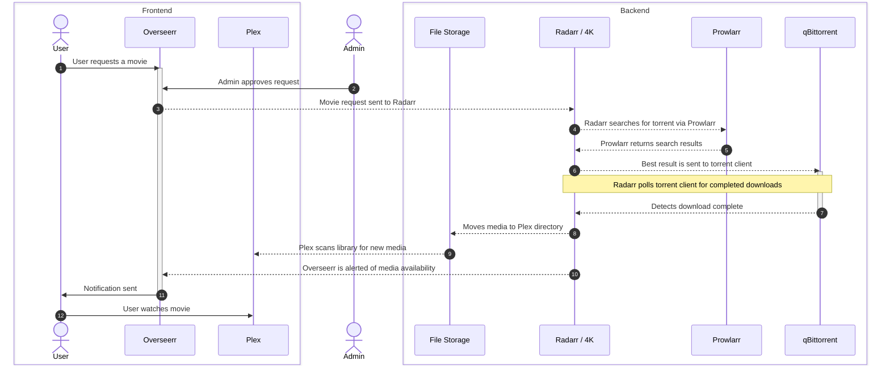
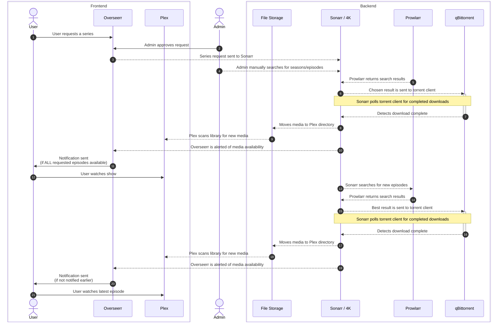

## Uptime Statistics

| Service                                    | Uptime (24h)                                                                                                                                    |                                                                                    Uptime (30d)                                                                                    |                                                                     Response Time (24h)                                                                    |
|--------------------------------------------|-------------------------------------------------------------------------------------------------------------------------------------------------|:----------------------------------------------------------------------------------------------------------------------------------------------------------------------------------:|:----------------------------------------------------------------------------------------------------------------------------------------------------------:|
| [Plex](https://app.plex.tv/)               |          | [&style=for-the-badge)](https://status.shaffer.media/)         |          |
| [Overseerr](https://request.shaffer.media) |     | [&style=for-the-badge)](https://status.shaffer.media/)    |     |
| [MovieMatch](https://match.shaffer.media)  |    | [&style=for-the-badge)](https://status.shaffer.media/)   |    |
| [Wrapperr](https://wrapped.shaffer.media)  |      | [&style=for-the-badge)](https://status.shaffer.media/)     |      |
| [Wizarr](https://join.shaffer.media)       |        | [&style=for-the-badge)](https://status.shaffer.media/)       |        |
|                                            |                                                                                                                                                 |                                                                                                                                                                                    |                                                                                                                                                            |
| Traefik                                    |       | [&style=for-the-badge)](https://status.shaffer.media/)      |       |
| Tautulli                                   |      | [&style=for-the-badge)](https://status.shaffer.media/)     |      |
| qBittorrent                                |   | [&style=for-the-badge)](https://status.shaffer.media/)  |   |
| Prowlarr                                   |     | [&style=for-the-badge)](https://status.shaffer.media/)    |     |
| Radarr (HD)                                |  | [&style=for-the-badge)](https://status.shaffer.media/) |  |
| Radarr (4K)                                |  | [&style=for-the-badge)](https://status.shaffer.media/) |  |
| Sonarr (HD)                                |  | [&style=for-the-badge)](https://status.shaffer.media/) |  |
| Sonarr (4K)                                |  | [&style=for-the-badge)](https://status.shaffer.media/) |  |
| Bazarr                                     |        | [&style=for-the-badge)](https://status.shaffer.media/)       |        |

## System Diagrams

### Movie Processing Using Overseerr

### Series Processing Using Overseerr

