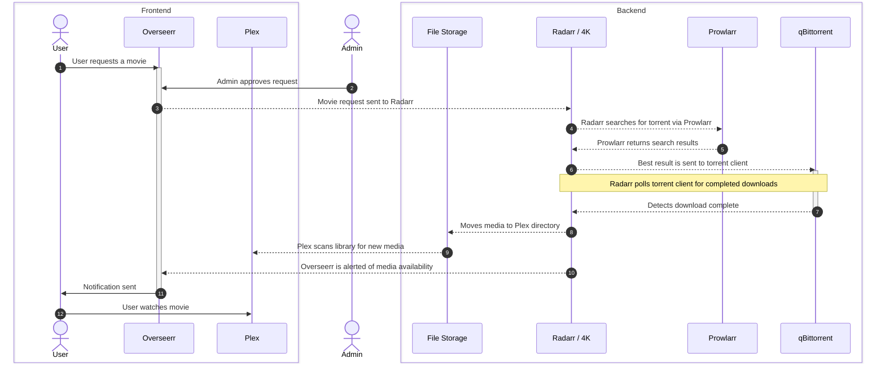
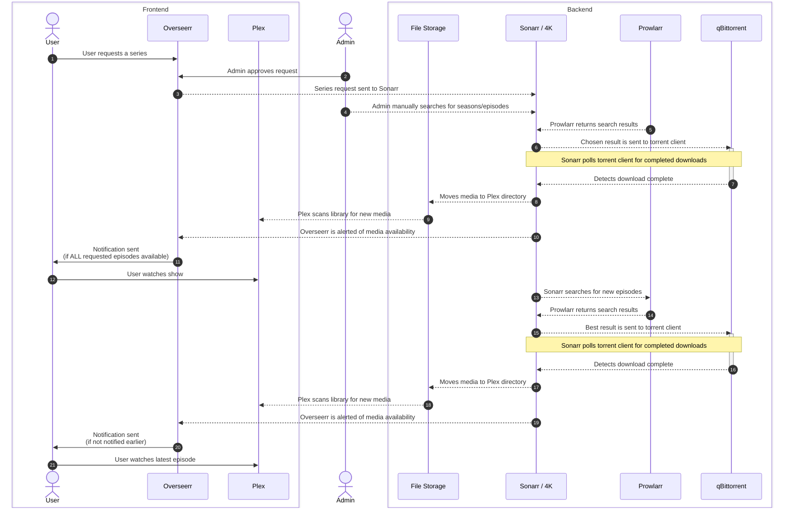

## 30-day Uptimes

| [&style=for-the-badge)](https://status.shaffer.media/) | [&style=for-the-badge)](https://status.shaffer.media/) | [&style=for-the-badge)](https://status.shaffer.media/) |
|---|---|---|
| [&style=for-the-badge)](https://status.shaffer.media/) | [&style=for-the-badge)](https://status.shaffer.media/) | [&style=for-the-badge)](https://status.shaffer.media/) |
| [&style=for-the-badge)](https://status.shaffer.media/) | [&style=for-the-badge)](https://status.shaffer.media/) | [&style=for-the-badge)](https://status.shaffer.media/) |

## System Diagrams

### Movie Processing Using Overseerr

### Series Processing Using Overseerr

